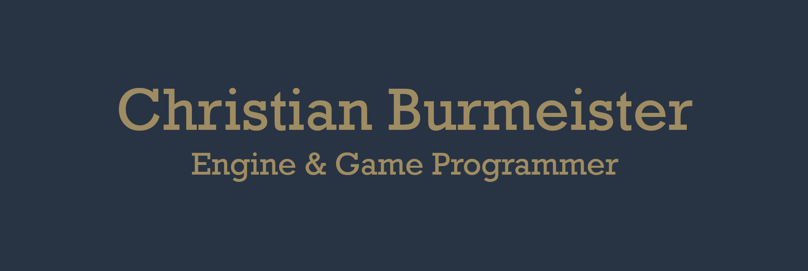

Hello there 👋,
I am an aspiring game and game engine programmer, that recently finished my bachelor at the Karlsruher Institute of Technology (KIT) in Karlsruhe, Germany. Always interested in solving and understanding complex black box systems and to provide solutions for other developers, with excellent time management skills. I have experience with C++17 and knowledge of DirectX 9.0c and 3D graphic rendering technologies.

## 💼 Skills

## 📬 Get in touch
E-Mail: mail@cburmeister.me

## My Projects
In Development:
- [rpg2k3-gb, 2022](https://github.com/lifebu/rpg2k3-gb): Gameboy Emulator written in C++ for RPGMaker 2003 with custom toolchain to allow compiling and debugging.

Other:
- [Bachelor Thesis, 2022](https://github.com/lifebu/BachelorThesis): Swarm Reinforcement Learning with Graph Neural Networks
- [Ant-RTS, 2021](https://github.com/lifebu/Ant-RTS): Real-time strategy (RTS) game prototype with an ant theme. 
- [Unity Engine Test Projects, 2018](https://github.com/lifebu/Unity-Projects): Collection of small experiments in the Unity Engine for learning purposes.
- [Orchid 2D Engine, 2014](https://github.com/lifebu/Orchid-2D-Engine): Game engine prototype using C++ and DirectX 9.

